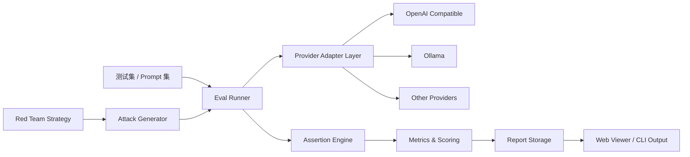

# howeverpromptfoo（LLM Evals & Red Team 工程）

<p align="center">
  
</p>

<p align="center">
  面向真实业务落地的 LLM 评测与红队测试工程仓，<br/>
  提供可评估、可对比、可审计、可回归的 AI 应用交付链路。
</p>

<p align="center">
  
  
  
  
  
</p>

---

## 目录

- [1. 项目概述](#1-项目概述)
- [2. 建设目标与设计原则](#2-建设目标与设计原则)
- [3. 适用场景](#3-适用场景)
- [4. 核心能力全景](#4-核心能力全景)
- [5. 架构总览](#5-架构总览)
- [6. 目录结构与职责](#6-目录结构与职责)
- [7. 快速开始](#7-快速开始)
- [8. 配置说明（本地化与敏感信息治理）](#8-配置说明本地化与敏感信息治理)
- [9. 评测工作流（Eval）](#9-评测工作流eval)
- [10. 红队工作流（Red Team）](#10-红队工作流red-team)
- [11. 部署方式](#11-部署方式)
- [12. CI/CD 与团队协作](#12-cicd-与团队协作)
- [13. 与原版 Promptfoo 的差异](#13-与原版-promptfoo-的差异)
- [14. 二次开发指南](#14-二次开发指南)
- [15. 常见问题（FAQ）](#15-常见问题faq)
- [16. 路线图](#16-路线图)
- [17. 安全与合规](#17-安全与合规)
- [18. 许可证与协议](#18-许可证与协议)

---

## 1. 项目概述

`howeverpromptfoo` 是基于上游 Promptfoo 工程能力构建的个人发行版，重点面向以下工程诉求：

1. 将模型评测纳入研发流水线，而不是停留在手工对话验证。
2. 将红队扫描前置到开发阶段，而不是线上事故后补救。
3. 将“提示词效果讨论”转化为可复现、可量化、可回归的指标体系。
4. 将本地模型（如 Ollama）与云模型（OpenAI 兼容接口）统一在同一套评测框架中。

该仓库适合作为：

- 个人/团队 AI 功能上线前的质量门禁工具。
- Prompt Engineering、Model Comparison、AI Security 的实践底座。
- 课程设计、毕业设计、技术分享中的工程级示例。

---

## 2. 建设目标与设计原则

### 2.1 建设目标

- 建立覆盖 Prompt、模型、工具调用、输出质量与安全风险的评测体系。
- 支持本地部署优先，避免敏感数据外泄风险。
- 支持 CI 自动执行，形成 PR 级别质量反馈。
- 支持差异对比，帮助快速定位“回归”与“退化”。

### 2.2 设计原则

- **数据驱动**：用指标替代主观感受。
- **最小侵入**：尽量不破坏上游主干结构，降低同步成本。
- **配置优先**：通过配置完成模型切换与策略调整。
- **安全前置**：红队与合规检查作为默认环节。
- **结果可复现**：同配置、同数据、同版本可重复得到同类结果。

---

## 3. 适用场景

### 3.1 研发团队

- 发布前验证问答准确率、拒答策略、工具调用稳定性。
- 比较多个模型在成本、时延、效果上的性价比。
- 在 PR 合并前自动执行回归评测。

### 3.2 安全与治理团队

- 对 RAG、Agent、工具链进行注入类风险扫描。
- 建立越权访问、敏感信息泄漏、策略绕过的自动检查集。
- 输出可审计报告用于内审或合规留档。

### 3.3 学习与研究

- 学习评测框架的工程落地方法。
- 复现实验并对比不同提示词策略效果。
- 训练“可解释 AI 迭代流程”而非“拍脑袋调参”。

---

## 4. 核心能力全景

| 能力域        | 说明                  | 典型输出             |
| ------------- | --------------------- | -------------------- |
| Prompt Eval   | Prompt 与模型效果评估 | 分数矩阵、断言报告   |
| Model Compare | 多模型横向对比        | 成本/时延/准确率对照 |
| Red Team      | 自动化安全测试        | 风险等级、漏洞类型   |
| CI Gate       | 流水线门禁            | Pass/Fail、回归告警  |
| Result View   | 结果可视化            | Web 报表与导出文件   |
| Config Stack  | 本地化配置治理        | 可复用配置模板       |

---

## 5. 架构总览



架构要点：

- Provider 层统一封装，降低模型切换成本。
- Eval 与 Red Team 共用执行与报告链路，减少重复建设。
- 报告侧同时支持 CLI 与 Web，兼顾自动化和人工复核。

---

## 6. 目录结构与职责

```text
.
├── src/                    # 核心执行逻辑（eval、providers、redteam、server）
├── src/app/                # Web 界面
├── site/                   # 文档站点
├── test/                   # 单元测试与集成测试
├── examples/               # 官方与扩展示例
├── configs/                # howeverpromptfoo 本地化配置模板
├── docs/assets/            # 品牌与文档资源
├── .env.however.example    # 本地环境变量模板
└── LICENSE-HOWEVER.md      # 项目附加协议说明
```

---

## 7. 快速开始

### 7.1 环境要求

- Node.js `20+`
- npm `10+`
- 可用的大模型 API Key（OpenAI 兼容）或本地 Ollama 服务

### 7.2 安装依赖

```bash
npm install
```

### 7.3 准备本地配置

```bash
cp .env.however.example .env.however.local
```

然后按实际环境修改：

- `OPENAI_API_KEY`
- `OLLAMA_BASE_URL`
- `HOWEVER_DB_URL`
- `HOWEVER_REDIS_URL`

### 7.4 运行基础流程

```bash
npm run build
npm run test
npx promptfoo eval
npx promptfoo view
```

---

## 8. 配置说明（本地化与敏感信息治理）

本仓库将“敏感信息与环境差异”作为一级配置治理对象，默认不在仓库中提交真实密钥。

### 8.1 环境变量模板

文件：`.env.however.example`

覆盖内容：

- 大模型密钥：`OPENAI_API_KEY`、`ANTHROPIC_API_KEY`
- 本地模型地址：`OLLAMA_BASE_URL`
- 存储后端：`HOWEVER_DB_URL`、`HOWEVER_REDIS_URL`
- 链路追踪：`OTEL_EXPORTER_OTLP_ENDPOINT`

### 8.2 本地栈配置模板

文件：`configs/however.local-stack.example.yaml`

能力：

- 一份 YAML 同时描述 provider、storage、telemetry。
- 支持 OpenAI 兼容接口与 Ollama 混合接入。
- 支持环境变量注入，避免明文配置。

### 8.3 配置模板速查表

| 场景         | 文件                                       | 说明                           |
| ------------ | ------------------------------------------ | ------------------------------ |
| 通用模板     | `.env.however.example`                     | 本地统一起步模板               |
| 开发环境     | `.env.however.dev.example`                 | 本机调试与迭代                 |
| 测试环境     | `.env.however.test.example`                | CI/测试隔离环境                |
| 生产环境     | `.env.however.prod.example`                | 部署参数占位模板               |
| 本地栈 YAML  | `configs/however.local-stack.example.yaml` | Provider + Storage + Telemetry |
| E2E 本地模型 | `configs/e2e/local-model.yaml`             | 本地推理链路验证               |
| E2E 云模型   | `configs/e2e/cloud-model.yaml`             | 云端模型链路验证               |
| E2E 混合模型 | `configs/e2e/hybrid-model.yaml`            | 本地 + 云混合验证              |

### 8.4 推荐治理策略

1. `.env` 文件只保留在本机，不进入版本库。
2. 开发、测试、生产使用不同密钥与不同后端地址。
3. 在 CI 中使用 Secret Manager 注入变量。
4. 对日志输出做密钥脱敏检查。

---

## 9. 评测工作流（Eval）

推荐流程：

1. 准备测试集（真实用户问题 + 反例 + 边界输入）。
2. 配置多模型 provider（云模型 + 本地模型）。
3. 设置断言（语义、格式、事实性、拒答策略）。
4. 执行评测并生成报告。
5. 对比与上一个基线版本的差异。

基础命令示例：

```bash
npx promptfoo eval -c examples/getting-started/promptfooconfig.yaml
npx promptfoo view
```

---

## 10. 红队工作流（Red Team）

红队流程建议按“攻击面 -> 攻击样本 -> 风险分级 -> 修复回归”闭环执行。

### 10.1 重点攻击面

- Prompt Injection
- Data Exfiltration
- Tool Abuse
- Policy Bypass
- Excessive Agency

### 10.2 执行建议

1. 每次引入新工具调用前执行一次全量扫描。
2. 每次系统提示词大改后执行一次回归扫描。
3. 将高风险漏洞修复后加入回归用例，避免二次复发。

---

## 11. 部署方式

### 11.1 本地开发部署

```bash
npm run dev
```

适合日常调试、策略迭代、前端结果查看。

### 11.2 Docker 部署

```bash
docker build -t howeverpromptfoo:local .
docker run --rm -p 15500:15500 --env-file .env.however.local howeverpromptfoo:local
```

适合团队演示与环境一致性验证。

### 11.3 CI 部署

- 在 GitHub Actions 或其他 CI 中注入密钥。
- 执行评测命令并上传结果产物。
- 将关键断言作为合并门禁条件。

---

## 12. CI/CD 与团队协作

推荐最小流水线：

1. `lint`：代码质量检查
2. `test`：单元与集成测试
3. `eval`：关键场景评测
4. `redteam`：风险扫描
5. `report`：发布报告与差异摘要

建议将以下指标写入 PR 模板：

- 评测通过率
- 高风险漏洞数量
- 相比基线的回归项数量

---

## 13. 与原版 Promptfoo 的差异

本仓库的定位是“个人工程发行版”，重点在工程交付与本地化治理。

| 维度         | 上游 Promptfoo | howeverpromptfoo                         |
| ------------ | -------------- | ---------------------------------------- |
| 文档主语言   | 英文           | 中文主文档 + 英文术语                    |
| 本地配置模板 | 以通用文档为主 | 提供 `.env.however.example` 与本地栈模板 |
| 项目品牌     | promptfoo      | howeverpromptfoo                         |
| 仓库元信息   | 官方社区信息   | 个人项目描述与 Topics 建议               |
| 协议附加说明 | 仅原许可证     | 新增 `LICENSE-HOWEVER.md`                |
| 改造建议文档 | 无             | 新增 60 条改造清单                       |

说明：

- 上游开源许可证与版权依然保留并优先适用。
- 本仓新增文档与配置模板用于提升个人项目可维护性与可交接性。

---

## 14. 二次开发指南

### 14.1 新增 Provider

建议在 `src/providers` 下按统一接口实现：

- 初始化参数校验
- 请求构造
- 错误归一化
- 速率限制与重试策略

### 14.2 新增断言

建议优先补测试，再接入运行链路：

1. 先写断言单测。
2. 再接入 eval 执行器。
3. 最后在示例配置中加入最小可运行案例。

### 14.3 新增红队策略

- 策略目录化管理。
- 策略说明文档化（攻击目标、触发条件、判定标准）。
- 与修复策略绑定回归测试。

---

## 15. 常见问题（FAQ）

### Q1：为什么我配置了 API Key 还是报鉴权失败？

请优先检查：

1. 是否复制并加载了 `.env.however.local`。
2. API Base URL 是否与 Key 类型匹配。
3. 是否存在代理或网关层拦截。

### Q2：Ollama 本地模型调用失败怎么办？

请检查：

1. `OLLAMA_BASE_URL` 是否可访问。
2. 本地模型是否已拉取并可用。
3. 端口防火墙与容器网络是否通。

### Q3：如何把评测结果接入团队看板？

建议导出关键指标并同步到：

- CI artifacts
- 内部看板系统
- 周报/版本发布说明

### Q4：如何避免“修一个洞又出一个洞”？

将已修复漏洞转成固定回归测试，并将其纳入 CI 门禁。

### Q5：我需要同时支持本地模型和云模型，配置怎么组织？

建议使用 `configs/however.local-stack.example.yaml` 作为总入口，通过环境变量切换不同 provider 地址与密钥。

### Q6：为什么我在 CI 里通过，本地却失败？

常见原因是本地 `.env` 与 CI Secret 不一致。请先执行 `npm run validate:however:env` 排查关键变量。

### Q7：依赖升级后出现隐性回归怎么办？

请按 `docs/dependency-change-checklist.zh-CN.md` 执行影响分析，并用基线结果做前后对比。

### Q8：如何在 PR 阶段就拦截密钥泄漏？

仓库已经在 pre-commit 与 CI 中加入 secret scan。请不要提交任何 `.env` 本地文件。

### Q9：如何评估一次改动是否影响性能？

执行 `npm run perf:baseline` 与 `npm run measure:build`，对比关键指标趋势。

### Q10：如何把红队策略做成可扩展插件？

可通过 `src/redteam/registry.ts` 注册自定义插件，再纳入生成与执行流程。

### Q11：如何处理上游同步冲突？

按 `docs/upstream-sync-playbook.zh-CN.md` 执行，先建同步分支，再完成回归后合并。

### Q12：如何规划版本发布节奏？

参考 `docs/release-strategy.zh-CN.md` 的分支与发布节奏，确保发布前执行 preflight 检查。

---

## 16. 路线图

### 16.1 短期（30 天）

- 完成核心场景评测模板沉淀。
- 完成关键红队策略自动化执行。
- 完成 PR 门禁基础链路。

### 16.2 中期（60 天）

- 引入多环境配置分层（dev/staging/prod）。
- 增强报告解释能力（趋势对比、分组统计）。
- 增加模型成本监控与预算预警。

### 16.3 长期（90 天）

- 建立跨项目统一 AI 质量标准。
- 构建组织级 AI 安全评测基线。
- 形成“评测即交付”的团队工程规范。

---

## 17. 安全与合规

### 17.1 最小安全基线

1. `.env` 本地文件不得提交。
2. 密钥与 Token 仅通过环境变量注入。
3. 评测日志与报告需做敏感字段脱敏。
4. 红队扫描应纳入版本发布前置流程。

### 17.2 合规建议

- 商业部署前完成许可证、隐私与数据处理合规审查。
- 对模型输出建立人工复核与事故回溯机制。
- 对外部集成服务建立最小权限访问控制。

---

## 18. 许可证与协议

- 原始开源许可证：见 `LICENSE`
- 项目附加协议说明：见 `LICENSE-HOWEVER.md`

请在二次分发或商用前，完整阅读以上文件，并结合你的业务场景执行合规审查。
