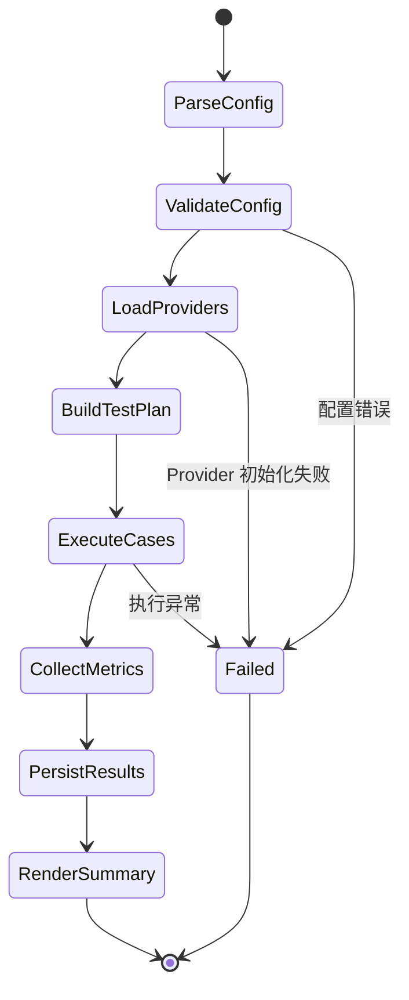

# 命令执行状态机

```mermaid
stateDiagram-v2
    [*] --> ParseConfig
    ParseConfig --> ValidateConfig
    ValidateConfig --> LoadProviders
    LoadProviders --> BuildTestPlan
    BuildTestPlan --> ExecuteCases
    ExecuteCases --> CollectMetrics
    CollectMetrics --> PersistResults
    PersistResults --> RenderSummary
    RenderSummary --> [*]

    ValidateConfig --> Failed: 配置错误
    LoadProviders --> Failed: Provider 初始化失败
    ExecuteCases --> Failed: 执行异常
    Failed --> [*]
```
